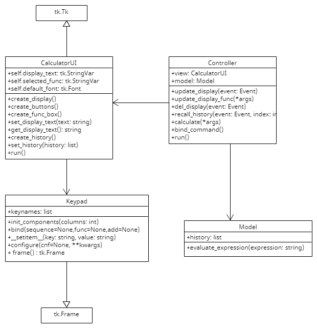

## Calculator
Simple calculator containing basic math functions

| file   | Description  |
|--------|--------------|
| model.py | The Model class that handle calculation and history. |
| controller.py | The Controller class that handle inputs. |
| calculator\_ui.py | The CalculatorUI class (view) for user interface. |
| keypad.py  | A composite class of tkinter.Frame
| main.py    | main block to run the program. |

## UML Class Diagram
